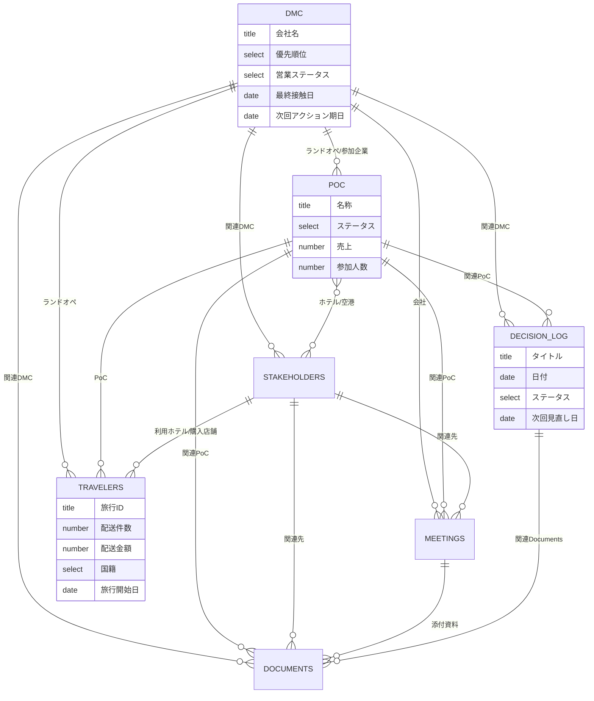

# 00. アーキテクチャ / 設計思想

## 0.1 設計原則

| 原則 | 具体 |
|------|------|
| **事業OSであること** | 営業だけでなく市場・PoC・旅行・物流・経営判断を1構造で保持 |
| **正規化** | 実体（会社・人・旅行・PoC・文書・判断）をDBに分離し、Relationで接続。二重入力を排除 |
| **分析前提の型付け** | 集計対象は必ず Number / Date / Select。自由記述（Text）に数値・区分を埋めない |
| **AI連携最優先** | 機械可読スキーマを正典化。プロパティ名は安定・一意。破壊的リネームを避ける |
| **静かなOS** | 通常はRollup/Formulaが自動計算。人は例外（要フォロー・見直し期限）にだけ反応する |
| **拡張性** | 新カテゴリはSelectの選択肢追加で対応。新DBはRelationで既存に接続 |

## 0.2 全体ER図



## 0.3 DBの役割と主キー

| # | Database | ID(内部名) | 役割 | Title列 | 主な分析軸 |
|---|----------|-----------|------|---------|-----------|
| ① | DMC / ランドオペレーター | `dmc` | 営業対象の企業台帳 | 会社名 | 優先順位 / ステータス / 得意国 |
| ② | Meetings | `meetings` | 商談記録・宿題・Next Action | タイトル | 日時 / PoC化可能性 |
| ③ | Travelers | `travelers` | 旅行×荷物の実績（分析の中心） | 旅行ID | 国籍 / 配送件数 / 期間 |
| ④ | Stakeholders | `stakeholders` | 関係者台帳（空港・ホテル等） | 名称 | カテゴリ / ステータス |
| ⑤ | Documents | `documents` | 文書ハブ | タイトル | 種別 / タグ |
| ⑥ | PoC | `poc` | 実証実験の計画・実績・結果 | 名称 | 地域 / ステータス / 売上 |
| ⑦ | Decision Log | `decision_log` | 経営判断の記録 | タイトル | カテゴリ / 日付 |

> `ID(内部名)` は本ドキュメントと [schema/bondex-os.schema.json](./schema/bondex-os.schema.json) で使う論理名。
> Notion上の実際のDB名は日本語表示名（例: `DMC / ランドオペレーター`）でよい。

## 0.4 命名規約（重要 / AI連携の生命線）

- **プロパティ名は日本語の表示名を正**とし、schema.json に英語論理キー（`snake_case`）を対で持つ。
- 一度公開したプロパティ名は**リネームしない**（Notion APIはプロパティ名かIDで参照するため、
  リネームすると自動化が壊れる）。意味変更が必要なら新プロパティを追加する。
- Select/Multi-selectの選択肢は [01-database-schema.md](./01-database-schema.md) に列挙した語を正とする。
  表記ゆれ（全角/半角・送り仮名）を作らない。
- 日付は単日=Date、期間=開始日/終了日の2プロパティに分ける（Formulaで日数算出）。
- 金額は円（¥, JPY）・重量はkg・件数は整数で統一。単位はプロパティ名に含めず、schema.jsonの`unit`で管理。

## 0.5 トップページ構成（Notionワークスペース）

```
🏠 BondEx OS（トップページ = Dashboard 04参照）
├── 🗄 Databases（全DBを格納する親ページ）
│   ├── ① DMC / ランドオペレーター
│   ├── ② Meetings
│   ├── ③ Travelers
│   ├── ④ Stakeholders
│   ├── ⑤ Documents
│   ├── ⑥ PoC
│   └── ⑦ Decision Log
└── 📚 Docs（本設計ドキュメントの写し・運用メモ）
```

DBは1つの親ページ「Databases」配下にフルページDBとして作成し、Dashboardからは
**リンクドビュー（Linked view of database）** で参照する。これにより本体は1箇所、表示は自由に増やせる。
